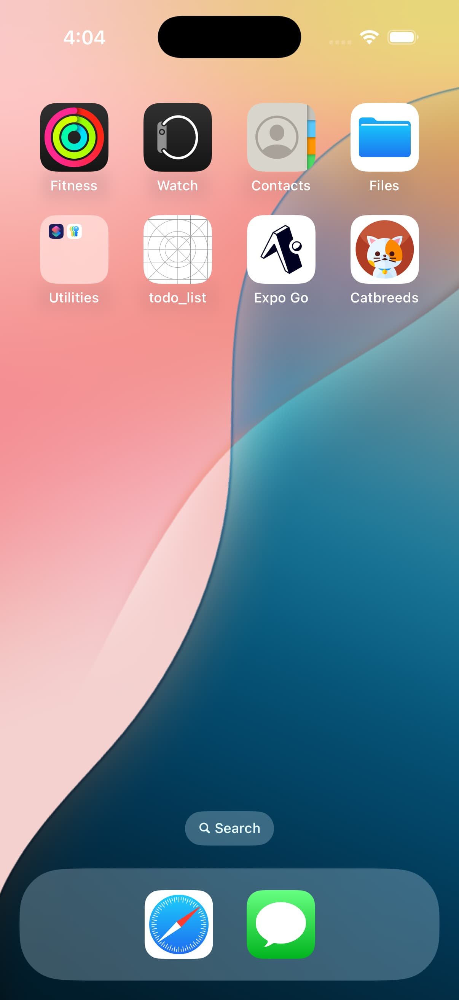
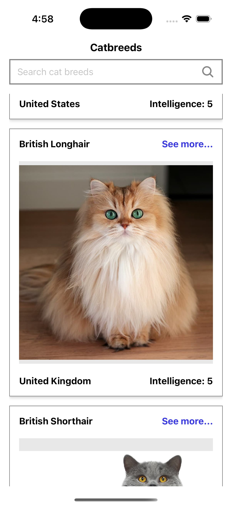
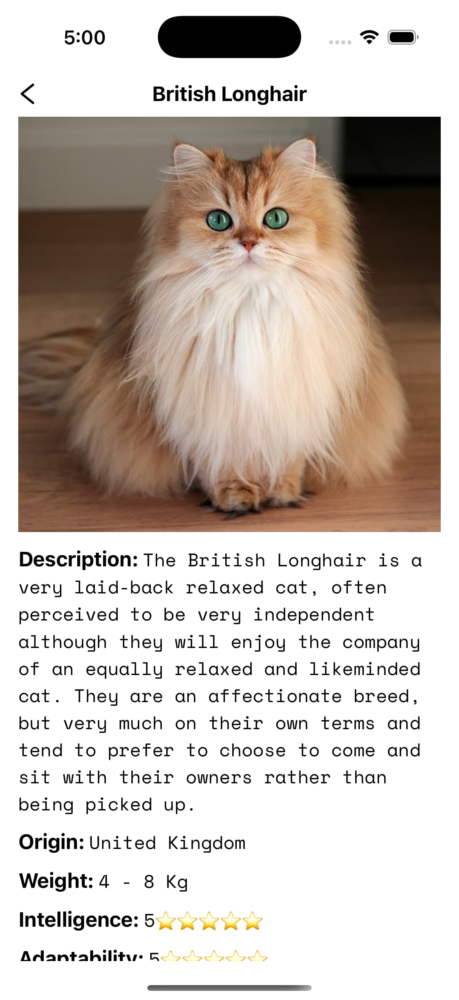
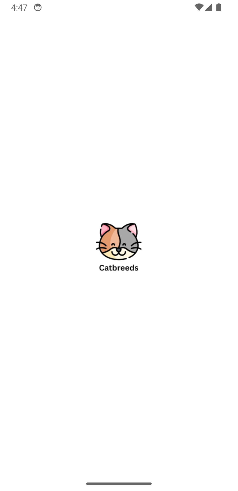
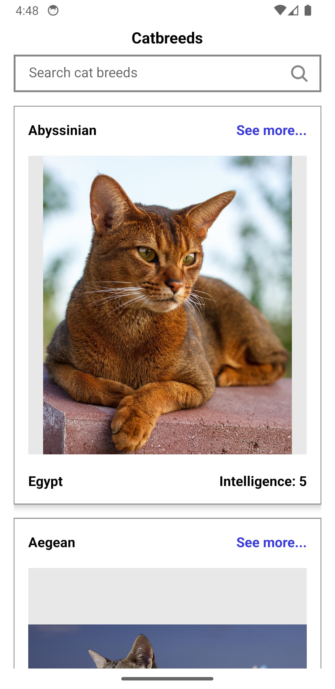
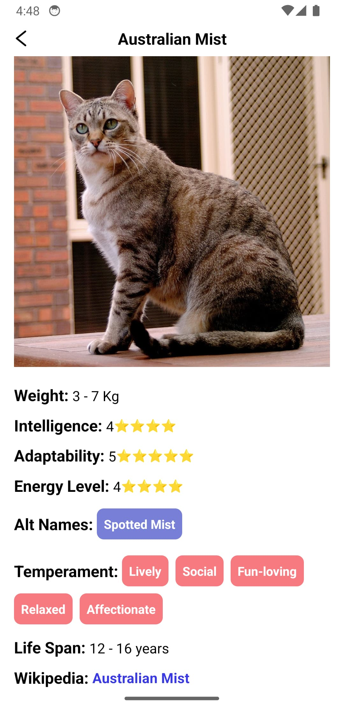

# Pragma

<div align="center">
    <h1>Catbreeds</h1>
    
</div>

<h2 align="center">IOS</h2>
<table align="center">
  <tr>
    <td></td>
    <td width="16"></td>
    <td></td>
    <td width="16"></td>
    <td></td>
  </tr>
</table>

<h2 align="center">Android</h2>

<table align="center">
  <tr>
    <td></td>
    <td width="16"></td>
    <td></td>
    <td width="16"></td>
    <td></td>
  </tr>
</table>


## Tech Stack
- React Native (0.79.2)
- Expo SDK (53.0.9)
- TypeScript
- Bun (Package Manager)
- Expo Router
- Redux & Redux Toolkit
- Jest & React Native Testing Library
- Biome (Formatting & Linting)

## Prerequisites
### Required Software
- [Node](https://nodejs.org/es) (18.x or higher, I'm using v18.17.1 )
- [Bun](https://bun.sh/) ( I'm using v1.2.9 )
- [Xcode (for iOS development)](https://developer.apple.com/documentation/safari-developer-tools/installing-xcode-and-simulators)
- [Android Studio (for Android development)](https://developer.android.com/studio)
- iOS Simulator or Android Emulator

## Installation Guide
### 1. Environment Setup

[Install NVM (Node Version Manager)](https://github.com/nvm-sh/nvm?tab=readme-ov-file#installing-and-updating):

```
# Using nvm (recommended)
curl -o- https://raw.githubusercontent.com/nvm-sh/nvm/v0.40.3/install.sh | bash

# Restart your terminal and install Node.js
nvm install 18.17.1
nvm use 18.17.1

# Verify installation
node --version
```

Install Bun 

For more detailed installation instructions (npm , homebrew, etc) and troubleshooting, visit the Bun [Installation Guide](https://bun.sh/docs/installation)

Using npm:

```
npm install -g bun
```

### 2. Project Setup
Clone and install:

```
git clone https://github.com/AndreSubia/catbreeds.git
cd catbreeds
bun install
```

Before running the development build or starting the project, make sure to create your `.env` file:

```bash
cp .env.example .env
```

Then, open the .env file and set your API key for [TheCatAPI](https://developers.thecatapi.com/) like this:

```
EXPO_PUBLIC_API_KEY=<your_api_key_here>
```

### 3. Running the Application ( Development Build )

> **Note:** You can also run the app using **Expo Go** during development, as long as you're not using custom native modules that require a prebuild.

```
# Start the development server
bun start

# Run on iOS simulator
bun ios

# Run on Android emulator
bun android
```

## Development Scripts

```
# Format code
bun format

# Lint code
bun lint

# Type checking
bun check
```

## Project Structure
```
catbreeds/
├── src/
   ├── api/
   ├── components/
   │   ├── atoms/
   │   ├── molecules/
   │   └── organisms/
   ├── hooks/
   ├── screens/
   ├── store/
   ├── styles/
   └── types/
```
## Key Features
- Atomic Design Pattern
- Type-Safe Development
- Global State Management
- Unit Testing
- Code Quality Tools

## Testing
The project uses Jest and React Native Testing Library for unit testing. Tests can be run using:

```
bun run test
```
## Code Quality
- Biome for formatting and linting
- TypeScript for type safety
- Pre-commit hooks with Lefthook
- Consistent code style enforcement

## Troubleshooting
### Common Issues

1. Metro Bundler Issues
```
# Clear Metro cache
bun start --clear
```
2. Dependencies Issues
```
# Clean install dependencies
bun install --force
```
3. Prebuild Issues
```
# Run a clean prebuild (removes native folders before rebuilding)
bun expo prebuild --clean
```

### Development Tips
- Use Expo Go app for testing on physical devices
- Check Expo documentation for specific version compatibility

## Additional Resources
- [Expo Documentation](https://docs.expo.dev/guides/using-bun/)
- [React Native Documentation](https://reactnative.dev/docs/environment-setup)

## Support
For any issues or questions, please open an issue in the repository.